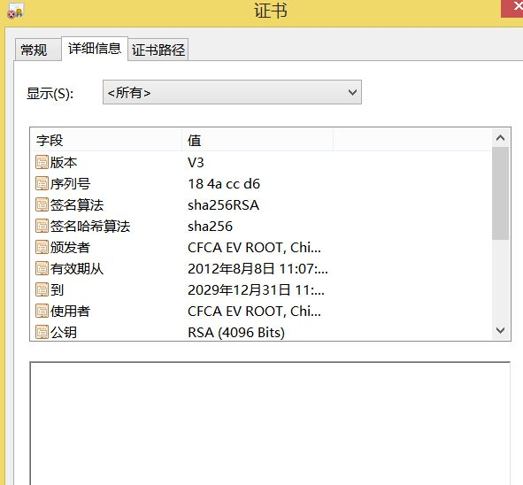
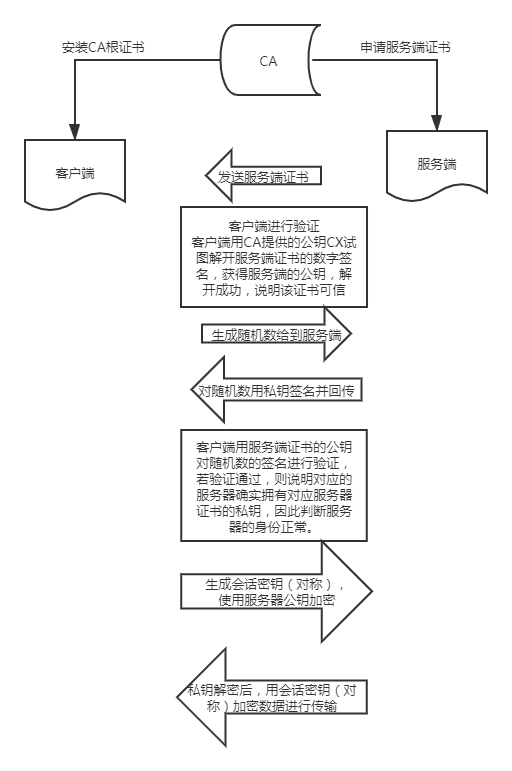

参考：《计算机网络-自顶向下方法》和https://www.zhihu.com/question/39136361/answer/80982546
# SSL证书验证
## 前置知识
1. 数字签名  
   A需要给B发一个文件。首先，把文件用一个散列函数进行处理，不管源文件有多大，处理结束后都会生成一个128位的二进制，称为“摘要”。
再用A的私钥把摘要进行加密，这个加密后的摘要，就叫A的数字签名。  
2. 证书  
   因为只有A持有私钥，所以只要能够用解密出明文，A就无法抵赖对此报文的签名。
   但是A可以说这个私钥不是我的，抵赖掉。这时，就需要一个大家都信任的官方机构，来统一颁布管理各个企业的基本信息以及公私钥。
   证书机构对发送端A的公钥AY用自己的私钥CX进行加密。然后把对应的公钥CY,证书的有效时间等放入证书。

## 验证步骤
发生在SSL建立的第一阶段：（握手阶段）
1. 服务器将自身的证书传输给客户端。
2. 客户端验证证书：先看CA的根证书是否在自己的信任根证书列表中。再用CA的根证书提供的公钥来验证服务器证书中的数字签名，如果公钥可以解开签名，证明该证书确实被CA所信任。再看证书是否过期，访问的网站域名与证书绑定的域名是否一致。这些都通过，说明证书可以信任。
3. 生成一个随机数给到服务端
4. 服务端对随机数进行签名，并回传给到客户端。
5. 客户端用服务器证书的公钥对随机数的签名进行验证，若验证通过，则说明对应的服务器确实拥有对应服务器证书的私钥，因此判断服务器的身份正常。否则，说明该服务器身份被伪造。这些都没问题才说明服务器是可信的。
6. 交换密钥
