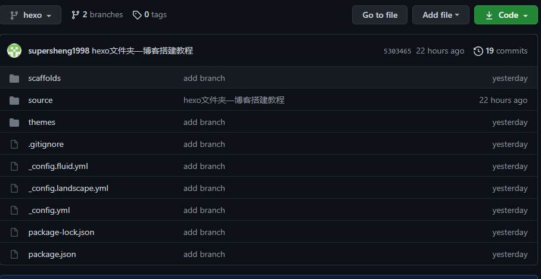

# 博客搭建教程
参考：https://www.zhihu.com/question/21193762/answer/489124966

## 原电脑
1. 先在github上新建一个hexo分支
2. 在这个仓库的settings中，选择默认分支为hexo分支
3. 在除了原博客目录下的其他目录下，打开git bash
4. git clone 你的博客仓库地址  
   如git clone git@github.com:supersheng1998/supersheng1998.github.io.git
5. 在克隆到本地的XXX.github.io中，把除了.git 文件夹外的所有文件都删掉
6. 把之前我们写的博客源文件全部复制过来，除了.deploy_git。  
   如果克隆过theme中的主题文件，则输出调theme中的.git文件夹。  
   注意得复制过来.gitignore。
7. 在当前bash里（此时是hexo分支），依次输入git add.; git commit -m "备注文本";git push origin hexo;
8. 完成，结果图如下，去GitHub的hexo分支看，是不是除node_modules、public、db.json都上传了。  

## 新电脑
1. 安装git和node.js,绑定GitHub账号和游戏，设置SSH
2. 新建文件夹，clone你的hexo分支。  
   git clone ...
3. 依次输入npm i hexo-cli -g；npm install；npm install hexo-deployer-git --save；
4. 然后就是可以写博客了
   
## 提示
1. 写之前git pull origin hexo
2. 每次写完先把源文件上传  
   git add.; git commit -m "备注文本";git push origin hexo;
3. 再执行hexo g; hexo d;