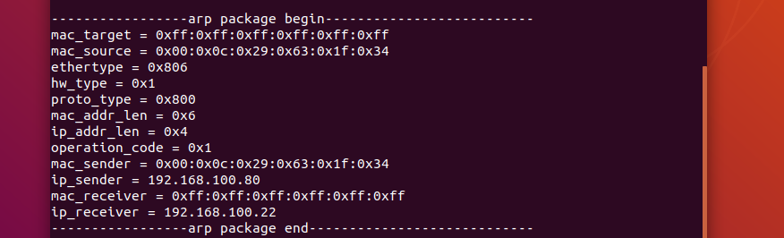

# linux下实现Arp发送和监听功能  
参考：https://blog.csdn.net/baidu_23081367/article/details/77199993

## 程序
```C++{.line-numbers}
#include <stdio.h>
#include <stdlib.h>
#include <string.h>
#include <sys/types.h>
#include <sys/socket.h>
#include <net/if.h>
#include <arpa/inet.h>
#include <netpacket/packet.h>
#include <net/ethernet.h>
#include <net/if_arp.h>
#include <iostream>
#include <unistd.h>
 
//如果只是想让对方断网，那就把mac源都设成MAC_TRICK，  
//#define MAC_TRICK {0x00, 0x00, 0x00, 0x00, 0x00, 0x00}

//想截获数据包那就用MAC_SOURCE  
unsigned char MAC_SOURCE[]=  {0x00,0x0c,0x29,0x63,0x1f,0x34};


//源IP  
const  char IP_SOURCE[]= "192.168.100.80";
//目标机器的MAC  
unsigned char MAC_TARGET[]= {0xff, 0xff, 0xff, 0xff, 0xff, 0xff};
//目标机器的IP  
const char IP_TARGET[]= "192.168.100.22" ; 

 
class arp_header
{
	public:
        //DLC Header
	    //接收方mac
		unsigned char mac_target[ETH_ALEN];
		//发送方mac
		unsigned char mac_source[ETH_ALEN];
		//Ethertype - 0x0806是ARP帧的类型值
		unsigned short ethertype;

		//ARP Frame
		//硬件类型 - 以太网类型值0x1
		unsigned short hw_type;
		//上层协议类型 - IP协议(0x0800)
		unsigned short proto_type;
		//MAC地址长度
		unsigned char mac_addr_len;
		//IP地址长度
		unsigned char ip_addr_len;
		//操作码 - 0x1表示ARP请求包,0x2表示应答包
		unsigned short operation_code;
		//发送方mac
		unsigned char mac_sender[ETH_ALEN];
		//发送方ip
		unsigned char ip_sender[4];
		//接收方mac
		unsigned char mac_receiver[ETH_ALEN];
		//接收方ip
		unsigned char ip_receiver[4];
		//填充数据
		unsigned char padding[18];//4
};

//arp类
class arp_packet
{
	public:
		static void die(const char*pre);
		static void print_arp_packet(arp_header ah);
 
		void arp_listen(); //arp监听服务启动
 
        //初始化arp
		void init_arp_send(unsigned char *iMAC_SOURCE, int LEN_MAC_SOURCE,const char IP_SOURCE[], unsigned char *iMAC_TARGET,int LEN_MAC_TARGET, const char IP_TARGET[]);
		void arp_send();//发送arp
 
	private:
        arp_header ah;//arp头
        //sockaddr_ll： 表示设备无关的物理层地址结构
		struct sockaddr_ll recv_saddr, send_saddr;
		int sfd;
		struct in_addr inaddr_send, inaddr_recv;  
}arp;
 
 
 
int main()
{
	arp_packet tmp;
	tmp.init_arp_send(MAC_SOURCE,sizeof(MAC_SOURCE) ,IP_SOURCE, NULL, sizeof(MAC_TARGET),IP_TARGET);
	tmp.arp_send();
	tmp.arp_listen();
	return 0;
 
}

/*
    arp发送
*/
void arp_packet::arp_send()
{
    printf("arp_publish_start\n");
	int count = 1;
	for(int i=0;i<count;i++)
	{
		int len = sendto(sfd, &ah, sizeof(ah), 0, (struct sockaddr*)&send_saddr, sizeof(send_saddr));
		print_arp_packet(ah);
		if(-1 == len)
		{
			die("sendto");
		}
		sleep(5);
	}
    printf("arp_publish_end\n");
}
 
 
void arp_packet::die(const char*pre)
{
    printf("arp_die\n");
	perror(pre);
	exit(1);
}


/*
    打印arp报文
    用于监听到arp报文后打印出来而已
*/
void arp_packet::print_arp_packet(arp_header ah)
{
	printf("\n\n-----------------arp package begin--------------------------\n");
 
	printf("mac_target = ");
	for(int i = 0; i < ETH_ALEN; i++)
	{
		printf(i > 0 ? ":0x%.2x" : "0x%.2x", ah.mac_target[i]);
	}
 
	printf("\nmac_source = ");
	for(int i = 0; i < ETH_ALEN; i++)
	{
		printf(i > 0 ? ":0x%.2x" : "0x%.2x", ah.mac_source[i]);
	}
 
	printf("\nethertype = 0x%x", ntohs(ah.ethertype));
	printf("\nhw_type = 0x%x", ntohs(ah.hw_type));
	printf("\nproto_type = 0x%x", ntohs(ah.proto_type));
	printf("\nmac_addr_len = 0x%x", ah.mac_addr_len);
	printf("\nip_addr_len = 0x%x", ah.ip_addr_len);
	printf("\noperation_code = 0x%x", ntohs(ah.operation_code));
 
	printf("\nmac_sender = ");
	for(int i = 0; i < ETH_ALEN; i++)
	{
		printf(i > 0 ? ":0x%.2x" : "0x%.2x", ah.mac_sender[i]);
	}
 
	printf("\nip_sender = %s", inet_ntoa(*(struct in_addr*)(ah.ip_sender)));
 
	printf("\nmac_receiver = ");
	for(int i = 0; i < ETH_ALEN; i++)
	{
		printf(i > 0 ? ":0x%.2x" : "0x%.2x", ah.mac_receiver[i]);
	}
 
	printf("\nip_receiver = %s", inet_ntoa(*(struct in_addr*)(ah.ip_receiver)));
 
	printf("\n-----------------arp package end----------------------------\n");
}
 
 
/*
·初始化arp头：
    - 设置协议类型
    - 设置4个地址
·设置原始套接字
*/ 
void arp_packet::init_arp_send(unsigned char *iMAC_SOURCE, int LEN_MAC_SOURCE,const char IP_SOURCE[], unsigned char *iMAC_TARGET,int LEN_MAC_TARGET, const char IP_TARGET[])
{
    //下面这个不知道有什么用
	memset(this, 0, sizeof(*this));
	
	sfd = socket(AF_PACKET, SOCK_RAW, htons(ETH_P_ARP));//ETH_P_ALL
	if (sfd == -1)
	{
		perror("error : build socket1\n");
		while(1);
	}
	
    printf("init_arp_publish_start\n");
    /*
    知识点：
      arp请求的目的MAC地址一开始就是全0的呀，因为他并不知道目的地址的MAC地址，
      而在传输arp请求时，将其封装成帧的时候，会将封装后的MAC帧地址设成全f，
      表示这是一个广播数据包，因此全0与全f只是划分层次不同而已
    */
    
	
	//初始化目标MAC地址为0xff
    if (iMAC_TARGET == NULL)//如果为空，全部设置为0xff
	{
		memset(ah.mac_target, 0xff, sizeof(ah.mac_target));
	}
	else//否则，赋值为MAC_TARGET，注意MAC_TARGET也是0xff
	{
		memmove(ah.mac_target, iMAC_TARGET, sizeof(LEN_MAC_TARGET));
	}

    
    for(int i = 0; i < ETH_ALEN; i++)
	{
		ah.mac_source[i]=MAC_SOURCE[i];
	}
	

	ah.ethertype = htons(0x0806);// 0x0806是ARP帧的类型值
	ah.hw_type = htons(0x1);//硬件类型0x1
	ah.proto_type = htons(0x0800);//上层协议类型 - IP协议(0x0800)
	ah.mac_addr_len = ETH_ALEN;
	ah.ip_addr_len = 4;
	ah.operation_code = htons(0x1);//操作码 - 0x1表示ARP请求包,0x2表示应答包
	
    
    for(int i = 0; i < ETH_ALEN; i++)
	{
		ah.mac_sender[i]=MAC_SOURCE[i];
	}
	
    
    //ip_sender发送方ip
	inet_aton(IP_SOURCE, &inaddr_send);
	memcpy(&ah.ip_sender, &inaddr_send, sizeof(inaddr_send));
	
    //mac_receiver = MAC_TARGET; 接收方mac
	memmove(&ah.mac_receiver, ah.mac_target, sizeof(ah.mac_target));

    //IP_TARGET；接收方IP
	inet_aton(IP_TARGET, &inaddr_recv);
	memcpy(&ah.ip_receiver, &inaddr_recv, sizeof(inaddr_recv));
 
	memset(&send_saddr, 0, sizeof(send_saddr));
	send_saddr.sll_family = AF_PACKET;//==历史原因PF_PACKET命名不同，或者说一个是协议簇一个是地址簇但值（=17）是一样的
	send_saddr.sll_ifindex = IFF_BROADCAST;//指定的接口名称的索引，非常重要  
    printf("init_arp_publish_end\n");
}

/*
    启动arp监听
*/
void arp_packet::arp_listen()
{
    printf("init_arp_server_start\n");
    //arp原始套接字
	memset(&ah, 0, sizeof(arp_header));
	
	sfd = socket(AF_PACKET, SOCK_RAW, htons(ETH_P_ARP));
	if (sfd == -1)
	{
		perror("error : build socket\n"); 
		while (1);
	}
    //创建地址结构
	memset(&recv_saddr, 0, sizeof(sockaddr_ll));
	recv_saddr.sll_family = AF_PACKET;
	recv_saddr.sll_protocol = htons(ETH_P_ARP);
	recv_saddr.sll_ifindex = IFF_BROADCAST;
    //连接
	if (-1 == bind(sfd, (struct sockaddr *)&recv_saddr, sizeof(recv_saddr)))
	{
		perror("error : something wrong in bind \n");
		while (1);
	}
    
	while(1)
	{
		if(-1 == recv(sfd, &ah, sizeof(ah), 0))
		{
			sleep(1);
			continue;
		}
		print_arp_packet(ah);
	}
	printf("init_arp_server_end\n");
}

```

## 运行
环境为ubuntu 18.04 、g++
注意允许得在root下


