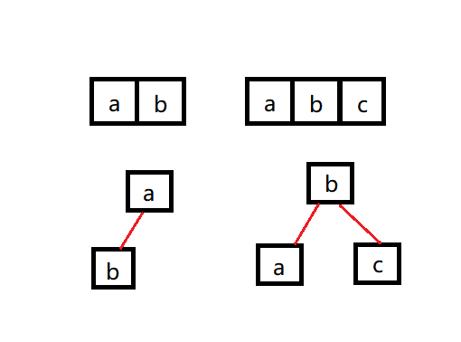
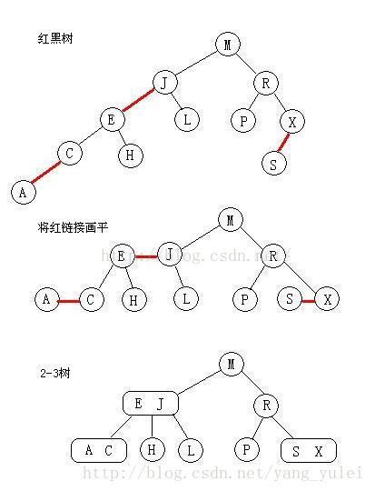
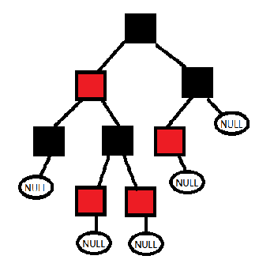

参考：《大话数据结构》和https://zhuanlan.zhihu.com/p/94575830
# 红黑树的前世
## 2-3-4树
### 定义
2-3-4树是对平衡二叉树的扩展  
先列出相关定义：  
- 在一个节点中，可以有1-3个key，左边比右边的值小。
- 2-节点，拥有1个key和2个子节点
- 3-节点，拥有2个key和3个子节点。
- 4-节点，拥有3个key和4个子节点。
- 任意从根节点到叶子节点的路径拥有相同的长度，即路径上的链接数相同。  

### 查找
- 查找类似二叉树，与当前节点的key进行比较。  
- 如果与当前节点的key有相等的，直接返回key对应的值。  
- 如果没有相等的：  
    - 2-节点：类似二叉树  
    - 3-节点：比最左边小就是左子树，比左边大右边小就是中间子树，比右边大就是右子树。  
    - 4-节点：类似3-节点

### 插入
注意：2-3-4树的插入，不会发生在中间节点，只会在叶子节点上进行插入。
1. 首先进行查找，找到插入的位置  
2. 如果是对2-节点插入，则2-节点变成3-节点
3. 如果是对3-节点插入，则3-节点变成4-节点
4. 如果是对4-节点插入，这时需要先将4-节点中间的节点提升到父节点，使父节点重新进行步骤2-4。
   然后4-节点降为3-节点，重新插入一个key成为4-节点。  

### 删除
- 如果删除的key是3-叶子节点或4-叶子节点直接删除即可
- 如果删除的key在2-叶子节点上，会导致树的平衡被破坏，因此得规避这种情况。
    - 将要被删除的叶子节点，从其兄弟节点“借”一个key进行融合变成3-节点；
    - 也可以将父节点的key和兄弟节点的key融合，变成一个4-节点；
    - 主要保证变化过程中树的平衡性不被破坏即可。变换完成之后的节点类型是3-或4-节点，自然就可以成功删除了。
- 删除非叶子节点，使用中序遍历下的直接后继节点key来覆盖当前节点key，再删除用来覆盖的后继节点key。
  
## 2-3-4树-->红黑树
### 2-3-4树的缺点
- 维持3种节点类型。
- 多种节点类型之间需要互相转换。
- 在树中移动需要进行多次比较，如果节点不是2-节点的话

### 进行转换
- 将2-3-4树用二叉树的形式表现。
- 节点之间的链接区分为红色和黑色。红色链接用于将节点链接起来视作3-节点和4-节点。
- 3-节点有两种链接，增大了复杂性，因此对转换要求增加一条约束，红色链接只能为左连接。

### 转换结果
- 通过三个约束后，转换得到二叉树我们称之为 __左倾斜红黑树__  
- 特点：
  - 转换后的二叉树可以使用二叉树的搜索方式。
  - 转换后的二叉树和2-3-4树处于一致关系，改变的只是表现形式
  - 完美黑色链接平衡的，即任意空链接到根结点的路径上的黑链接数量相同。 
- 如果你将红黑树中所有的红色链接放平，那么它就和2-3-4树在展现上一致。
借一张别人的图，形象的表示了2-3-4树和红黑树的关系：

### 左倾斜红黑树特点
- 红链接均为左链接
- 不能出现连续的红连接
- 叶子节点到根结点的路径上的黑链接数量相同

__这样就可以和红黑树的定义结合起来了。__

## 红黑树
### 红黑树的定义
1. 每个节点非黑即红 
2. 根节点是黑色
3. 叶节点（含空节点）是黑色 
4. 如一个节点是红色，则它的两个子节点都是黑色的
5. 从根节点触发到所有叶节点路径上，黑色节点数量相同 （最长是最短路径的2倍：长边红黑相间，短边全黑）

